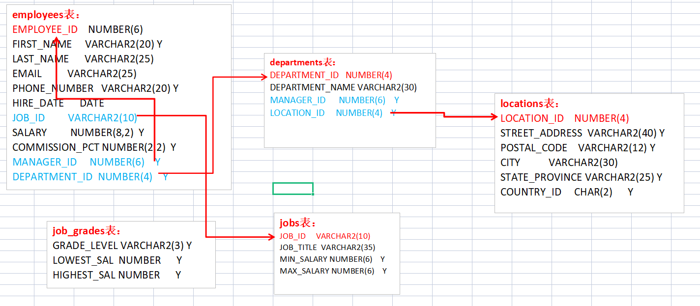

## Oracle笔记

### 一、DML练习

#### 1、SELECT基本操作

```sql
--导入表
@f:/del_data.sql
@f:/hr_cre.sql
@f:/hr_popul.sql
```

表关系图:



```sql
--表的描述
desc employees;

--查所有的列

--查指定的列

--算术运算符
select 8*4 from dual;
select sysdate, sysdate+1, sysdate-1 from dual;

--编辑sql
edit
ed
/

--null值
--null不同于0, 凡是空值参与的运算都为空


--别名
--别名默认都是大写,可以用双引号确定别名是大写还是小写

--连接符||
--别列与列,列与字符连接在一起


--distinct去重

```


#### 2、过滤和排序

```sql
--过滤where ()

--转义字符 \或# escape

--排序 order by 

```


#### 3、单行函数

```sql
--一行数据对应一个结果就是单行函数
```


### 二、