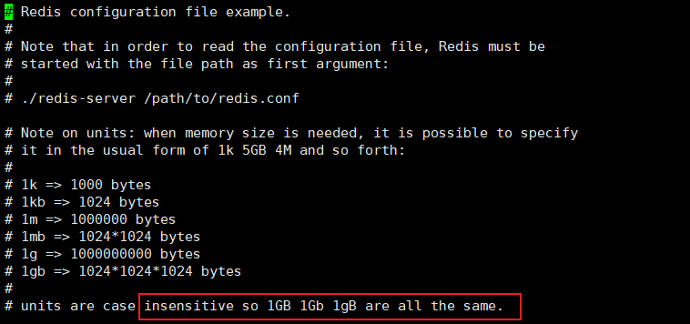
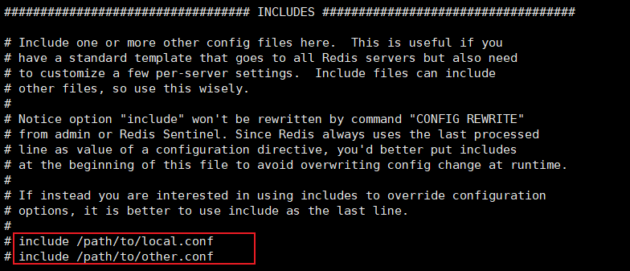
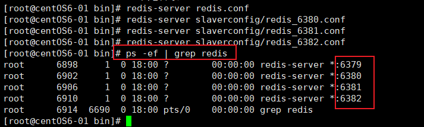
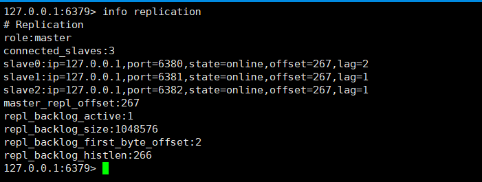
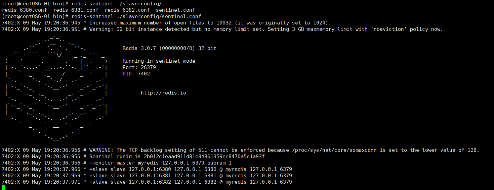
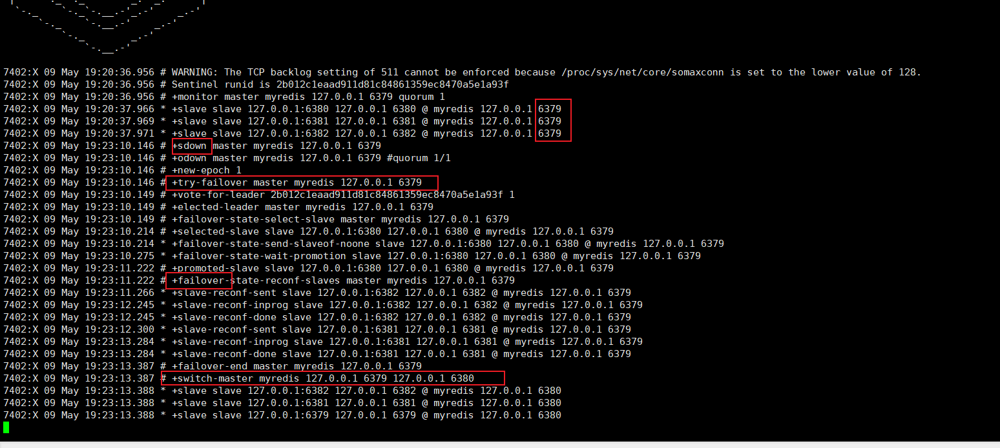

# Redis

### 一、NoSql


### 二、Redis概述


### 三、Redis安装


### 四、性能测试


### 五、五大数据类型

#### 1、String


#### 2、List 

​	list 实际是一个链表

```bash
127.0.0.1:6379> keys *
(empty list or set)
127.0.0.1:6379> lpush list one
(integer) 1
127.0.0.1:6379> lpush list two
(integer) 2
127.0.0.1:6379> lpush list three
(integer) 3
127.0.0.1:6379> lrange list 0 -1
1) "three"
2) "two"
3) "one"
127.0.0.1:6379> lrange list 0 1
1) "three"
2) "two"
127.0.0.1:6379> Rpush list right #将一个值或者多个值插入头部
(integer) 4
127.0.0.1:6379> lrange list 0 -1
1) "three"
2) "two"
3) "one"
4) "right"
####################################################
127.0.0.1:6379> lrange list 0 -1
1) "three"
2) "two"
3) "one"
4) "right"
127.0.0.1:6379> Lpop list
"three"
127.0.0.1:6379> Rpop list
"right"
127.0.0.1:6379> lrange list 0 -1
1) "two"
2) "one"
####################################################
127.0.0.1:6379> lindex list 1
"one"
127.0.0.1:6379> lindex list 0
"two"
####################################################
127.0.0.1:6379> flushdb
OK
127.0.0.1:6379> keys *
(empty list or set)
127.0.0.1:6379> lpush list one
(integer) 1
127.0.0.1:6379> lpush list two
(integer) 2
127.0.0.1:6379> lpush list three
(integer) 3
127.0.0.1:6379> llen list
(integer) 3
####################################################
127.0.0.1:6379> lpush list three
(integer) 4
127.0.0.1:6379> lrange list 0 -1
1) "three"
2) "three"
3) "two"
4) "one"
127.0.0.1:6379> lrem list 1 one #移除值 移除指定个数的某个值
(integer) 1
127.0.0.1:6379> lrange list 0 -1
1) "three"
2) "three"
3) "two"
127.0.0.1:6379> lrem list 1 three
(integer) 1
127.0.0.1:6379> lrange list 0 -1
1) "three"
2) "two"
########################## trim截取 ##########################
127.0.0.1:6379> clear
127.0.0.1:6379> Rpush mylist hello1
(integer) 1
127.0.0.1:6379> Rpush mylist hello2
(integer) 2
127.0.0.1:6379> Rpush mylist hello3
(integer) 3
127.0.0.1:6379> Rpush mylist hello4
(integer) 4
127.0.0.1:6379> lrange mylist 0 -1
1) "hello1"
2) "hello2"
3) "hello3"
4) "hello4"
127.0.0.1:6379> ltrim mylist 1 2
OK
127.0.0.1:6379> lrange mylist 0 -1
1) "hello2"
2) "hello3"

########################## RpopLpush ##########################
127.0.0.1:6379> keys *
(empty list or set)
127.0.0.1:6379> rpush mylist hello1
(integer) 1
127.0.0.1:6379> rpush mylist hello2
(integer) 2
127.0.0.1:6379> rpush mylist hello3
(integer) 3
127.0.0.1:6379> rpush mylist hello4
(integer) 4
127.0.0.1:6379> lrange mylist 0 -1
1) "hello1"
2) "hello2"
3) "hello3"
4) "hello4"
127.0.0.1:6379> rpoplpush mylist myotherlist #source右边pop destin左边push
"hello4"
127.0.0.1:6379> lrange mylist 0 -1
1) "hello1"
2) "hello2"
3) "hello3"
127.0.0.1:6379> lrange myotherlist 0 -1
1) "hello4"
127.0.0.1:6379> lpoplpush mylist myotherlist
(error) ERR unknown command 'lpoplpush'
127.0.0.1:6379> lpoprpush mylist myotherlist
(error) ERR unknown command 'lpoprpush'

########################## exists lset更新值 ##########################
127.0.0.1:6379> keys *
(empty list or set)
127.0.0.1:6379> exists list
(integer) 0
127.0.0.1:6379> lset list 0 item #将列表中指定下标的值替换为另外一个值 更新操作
(error) ERR no such key
127.0.0.1:6379> lpush list value1
(integer) 1
127.0.0.1:6379> lrange list 0 -1
1) "value1"
127.0.0.1:6379> lset list 0 item
OK
127.0.0.1:6379> lrange list 0 -1
1) "item"
127.0.0.1:6379> lset list 1 other 	# 不存在就会报错
(error) ERR index out of range

########################## linsert ##########################
127.0.0.1:6379> clear
127.0.0.1:6379> keys *
(empty list or set)
127.0.0.1:6379> Rpush mylist hello 
(integer) 1
127.0.0.1:6379> Rpush mylist world
(integer) 2
127.0.0.1:6379> lrange mylist 0 -1
1) "hello"
2) "world"
127.0.0.1:6379> linsert mylist before world old #将某个具体的value插入到列表中某个元素的前/后
(integer) 3
127.0.0.1:6379> lrange mylist 0 -1
1) "hello"
2) "old"
3) "world"
127.0.0.1:6379> linsert mylist after world new
(integer) 4
127.0.0.1:6379> lrange mylist 0 -1
1) "hello"
2) "old"
3) "world"
4) "new"

```


#### 3、Set 

set里面的值不能重复, 无序

```bash
#######################################################
127.0.0.1:6379> keys *
(empty list or set)
127.0.0.1:6379> sadd myset hello 	#往set添加值
(integer) 1
127.0.0.1:6379> sadd myset mr.zhang
(integer) 1
127.0.0.1:6379> sadd myset world
(integer) 1
127.0.0.1:6379> smembers myset	#查看set所有值
1) "world"
2) "hello"
3) "mr.zhang"
127.0.0.1:6379> sismember myset hello #看set里面是否有某个值
(integer) 1
127.0.0.1:6379> sismember myset nihao
(integer) 0
127.0.0.1:6379> scard myset #获取set集合中的元素的个数
(integer) 3
127.0.0.1:6379> srem myset hello #移除set中的某个元素
(integer) 1
127.0.0.1:6379> smembers myset #
1) "world"
2) "mr.zhang"


#######################################################
127.0.0.1:6379> sadd myset hello 
(integer) 1
127.0.0.1:6379> sadd myset hello1 
(integer) 1
127.0.0.1:6379> sadd myset hello2
(integer) 1
127.0.0.1:6379> srandmember myset #随机获取set里面的一个值
"world"
127.0.0.1:6379> srandmember myset
"hello1"
127.0.0.1:6379> srandmember myset
"hello2"
127.0.0.1:6379> srandmember myset 2
1) "world"
2) "hello"
127.0.0.1:6379> srandmember myset 2
1) "mr.zhang"
2) "hello2"


#######################################################
127.0.0.1:6379> spop myset #随机移除set中的一个值
"hello2"
127.0.0.1:6379> smembers myset
1) "mr.zhang"
2) "world"
3) "hello"
4) "hello1"
127.0.0.1:6379> smembers myset
1) "mr.zhang"
2) "world"
3) "hello"
4) "hello1"
127.0.0.1:6379> spop myset
"mr.zhang"
127.0.0.1:6379> smembers myset
1) "world"
2) "hello"
3) "hello1"

#######################################################
移动一个指定的值,到另外一个set集合中
127.0.0.1:6379> keys *
(empty list or set)
127.0.0.1:6379> sadd myset hello
(integer) 1
127.0.0.1:6379> sadd myset world
(integer) 1
127.0.0.1:6379> sadd myset hello1
(integer) 1
127.0.0.1:6379> sadd myset hello2
(integer) 1
127.0.0.1:6379> smembers
(error) ERR wrong number of arguments for 'smembers' command
127.0.0.1:6379> smembers myset
1) "hello1"
2) "world"
3) "hello"
4) "hello2"
127.0.0.1:6379> sadd myset2 myset2
(integer) 1
127.0.0.1:6379> smove myset myset2 "world" #移动set集合中的某个值到另外一个集合中
(integer) 1
127.0.0.1:6379> smembers myset
1) "hello1"
2) "hello"
3) "hello2"
127.0.0.1:6379> smembers myset2
1) "world"
2) "myset2"

#######################################################
叉集 交集 并集
127.0.0.1:6379> keys *
(empty list or set)
127.0.0.1:6379> sadd key1 a
(integer) 1
127.0.0.1:6379> sadd key1 a
(integer) 0
127.0.0.1:6379> sadd key1 b
(integer) 1
127.0.0.1:6379> sadd key1 c
(integer) 1
127.0.0.1:6379> sadd key1 d
(integer) 1
127.0.0.1:6379> sadd key2 c 
(integer) 1
127.0.0.1:6379> sadd key2 d
(integer) 1
127.0.0.1:6379> sadd key2 e
(integer) 1
127.0.0.1:6379> sadd key2 f
(integer) 1
127.0.0.1:6379> sdiff key1 key2 #叉集
1) "b"
2) "a"
127.0.0.1:6379> sdiff key2 key1
1) "f"
2) "e"
127.0.0.1:6379> sinter key1 key2 #交集 共同好友就可以这样实现
1) "d"
2) "c"
127.0.0.1:6379> sunion key1 key2 #并集
1) "c"
2) "f"
3) "b"
4) "a"
5) "d"
6) "e"
#######################################################
```


#### 4、Hash

Map集合, key-map 

hash更适合对象的存储

```bash
#######################################################
127.0.0.1:6379> hset myhash field1 zhang #设置一个Key-value
(integer) 1
127.0.0.1:6379> hget myhash field1
"zhang"
127.0.0.1:6379> hmset myhash field1 hello field2 world #设置多个
OK
127.0.0.1:6379> hmget myhash field1 field2 #获取
1) "hello"
2) "world"
127.0.0.1:6379> hgetall myhash
1) "field1"
2) "hello"
3) "field2"
4) "world"
127.0.0.1:6379> hdel myhash field1
(integer) 1
127.0.0.1:6379> hgetall
(error) ERR wrong number of arguments for 'hgetall' command
127.0.0.1:6379> hgetall myhash
1) "field2"
2) "world"
127.0.0.1:6379> hlen myhash
(integer) 1
127.0.0.1:6379> hexists myhash field1
(integer) 0
127.0.0.1:6379> hexists myhash field2
(integer) 1


#######################################################
127.0.0.1:6379> hset myhash field1 hello
(integer) 1
127.0.0.1:6379> hset myhash field3 zhang
(integer) 1
127.0.0.1:6379> hgetall myhash
1) "field2"
2) "world"
3) "field1"
4) "hello"
5) "field3"
6) "zhang"
127.0.0.1:6379> hkeys myhash
1) "field2"
2) "field1"
3) "field3"
127.0.0.1:6379> hvals myhash
1) "world"
2) "hello"
3) "zhang"
127.0.0.1:6379> hset myhash field4 5
(integer) 1
127.0.0.1:6379> hgetall myhash
1) "field2"
2) "world"
3) "field1"
4) "hello"
5) "field3"
6) "zhang"
7) "field4"
8) "5"
127.0.0.1:6379> hincrby myhash field4 1
(integer) 6
127.0.0.1:6379> hincrby myhash field4 -2
(integer) 4
127.0.0.1:6379> hsetnx myhash field5 yi #是否存在
(integer) 1
127.0.0.1:6379> hgetall myhash
 1) "field2"
 2) "world"
 3) "field1"
 4) "hello"
 5) "field3"
 6) "zhang"
 7) "field4"
 8) "4"
 9) "field5"
10) "yi"

#######################################################
127.0.0.1:6379> hmset user:1 name zhang age 18
OK
127.0.0.1:6379> hgetall user:1
1) "name"
2) "zhang"
3) "age"
4) "18"
127.0.0.1:6379> hget user:1 nage
(nil)
127.0.0.1:6379> hget user:1 name
"zhang"
#######################################################
```


#### 5、Zset有序集合

set k1 v1

zset k1 score v1

```bash
#######################################################
127.0.0.1:6379> keys *
(empty list or set)
127.0.0.1:6379> zadd myset 1 one
(integer) 1
127.0.0.1:6379> zadd myset 2 two 3 three
(integer) 2
127.0.0.1:6379> zrange myset 0 -1
1) "one"
2) "two"
3) "three"
127.0.0.1:6379> zadd salary 2500 xianghong 5000 zhangsan 200 lisi
(integer) 3
127.0.0.1:6379> zrange salary 0 -1
1) "lisi"
2) "xianghong"
3) "zhangsan"
127.0.0.1:6379> zrangebyscore salary -inf +inf
1) "lisi"
2) "xianghong"
3) "zhangsan"
127.0.0.1:6379> zrevrange salary 0 -1
1) "zhangsan"
2) "xianghong"
3) "lisi"
127.0.0.1:6379> zrangebyscore salary -inf +inf withscores
1) "lisi"
2) "200"
3) "xianghong"
4) "2500"
5) "zhangsan"
6) "5000"
127.0.0.1:6379> zrangebyscore salary -inf 2500 withscores
1) "lisi"
2) "200"
3) "xianghong"
4) "2500"

#######################################################
127.0.0.1:6379> zrange salary 0 -1
1) "lisi"
2) "xianghong"
3) "zhangsan"
127.0.0.1:6379> zrange myset 0 -1
1) "one"
2) "two"
3) "three"
127.0.0.1:6379> zrem myset one
(integer) 1
127.0.0.1:6379> zrange myset 0 -1
1) "two"
2) "three"

#######################################################
127.0.0.1:6379> keys *
1) "salary"
2) "myset"
127.0.0.1:6379> zcard salary
(integer) 3
127.0.0.1:6379> zcard myset
(integer) 2

#######################################################
127.0.0.1:6379> zcount myset 1 3
(integer) 2
127.0.0.1:6379> zgetall myset
(error) ERR unknown command 'zgetall'
127.0.0.1:6379> zrange myset 0 -1
1) "two"
2) "three"
127.0.0.1:6379> zadd myset 4 four
(integer) 1
127.0.0.1:6379> zadd myset 5 five
(integer) 1
127.0.0.1:6379> zcount myset 1 4
(integer) 3
#########################################################


```

Zset 比set多了一个排序 存储班级成绩表 工资表排序 带权重执行 Top-N


### 六、三种特殊数据类型

#### 1、geospatial

​	地理位置, 朋友的定位,附近的人,打车距离. Redis3.2版本就推出了. 

​	可以计算两地之间的距离

​	位置信息的底层是现实其实就是Zset.可以使用Zset来操作geo

```bash
#########################################################
#规则:两级无法直接添加 java程序可以通过配置文件一次导入
geoadd china:city 116.40 39.90 beijin #添加城市经纬度 180到-180 85到-85

geopos china:city beijin #获取指定的城市的经纬度

geodist china:city beijin shanghai km #定位距离 单位m km 

georadius chian:city 110 30 1000 km withdist  #附近的人 参数 以某个经纬度为中心 半径 多少

georadiusbymember china:city beijing 1000 km # 找出位于指定元素周围的城市

geohash china:city beijing chongqing # 返回的当前城市的经纬度转换成一维的字符串
```


#### 2、Hyperloglog

​	什么是基数? 不重复的元素. 可以接受误差 

​	Redis 2.8.9版本就更新了Hyperloglog数据结构! 基数统计的算法

​	应用场景: 访问量,一个人访问多次算一次.

​	优点:占用内存是固定的, 2^64不同的元素,只需要12KB内存. 有误差0.81%的误差

```bash
#########################################################
127.0.0.1:6379> Pfadd mykey a b c d e f
(integer) 1
127.0.0.1:6379> pfcount mykey
(integer) 6
127.0.0.1:6379> Pfadd mykey a b c d e f
(integer) 0
127.0.0.1:6379> pfcount mykey
(integer) 6
127.0.0.1:6379> pfadd mykey2 a b c z y z
(integer) 1
127.0.0.1:6379> pfcount mykey2
(integer) 5
127.0.0.1:6379> pfmerge mykey3 mykey mykey2
OK
127.0.0.1:6379> pfcount mykey3
(integer) 8

```


#### 3、Bitmaps

​	位存储 

​	统计用户信息, 活跃/不活跃 、登录/未登录、 打卡/未打卡. 只有两个状态的,都可以使用Bitmaps!

```bash
#########################################################
#周一到周日的打卡情况
127.0.0.1:6379> clear
127.0.0.1:6379> keys * 
(empty list or set)
127.0.0.1:6379> setbit sign 0 1 #设置每一天打卡的情况
(integer) 0
127.0.0.1:6379> setbit sign 1 1 
(integer) 0
127.0.0.1:6379> setbit sign 2 1 
(integer) 0
127.0.0.1:6379> setbit sign 3 1 
(integer) 0
127.0.0.1:6379> setbit sign 4 1 
(integer) 0
127.0.0.1:6379> setbit sign 5 0 
(integer) 0
127.0.0.1:6379> setbit sign 6 0 
(integer) 0
127.0.0.1:6379> getbit sign 5 	#查看某一天的打卡情况
(integer) 0
127.0.0.1:6379> getbit sign 4
(integer) 1
127.0.0.1:6379> bitcount sign 0 6 #统计这一周打卡的情况
(integer) 5


```


### 七、Redis事务

#### 1、什么是事务

	>事务的本质 = 一组命令的集合!

​	==Redis事务没有隔离级别的概念==

​	要么同时成功,要么同时失败, 原子性. 

​	==Redis单条命令是原子性, 事务是没有原子性的==

#### 2、Redis事务开启

- 开启事务 (multi)
- 命令入队 (....)
- 执行事务 (exec)

```bash
###########################################################
127.0.0.1:6379> multi
OK
127.0.0.1:6379> set k1 v1
QUEUED
127.0.0.1:6379> set k2 v2
QUEUED
127.0.0.1:6379> get k2
QUEUED
127.0.0.1:6379> set k3 v3
QUEUED
127.0.0.1:6379> exec
1) OK
2) OK
3) "v2"
4) OK
################################################################
#取消事务
127.0.0.1:6379> multi 
OK
127.0.0.1:6379> set k1 v1
QUEUED
127.0.0.1:6379> set k2 v2 
QUEUED
127.0.0.1:6379> set k4 v4
QUEUED
127.0.0.1:6379> discard
OK
127.0.0.1:6379> get k4
(nil)
127.0.0.1:6379> get k3
"v3"
################################################################
```


#### 4、Redis事务异常

	>编译异常(语法有问题, 命令有问题), 事务中所有的命令都不会被执行

```bash
### 所有的命令都不会执行
127.0.0.1:6379> multi
OK
127.0.0.1:6379> set k1 v1
QUEUED
127.0.0.1:6379> set k2 v2
QUEUED
127.0.0.1:6379> getset k3
(error) ERR wrong number of arguments for 'getset' command
127.0.0.1:6379> set k4 v4
QUEUED
127.0.0.1:6379> exec
(error) EXECABORT Transaction discarded because of previous errors.
127.0.0.1:6379> get k1
(nil)
```


>运行时异常(1/0)  异常的语句不会让它异常,其他的语句还是执行

```bash
127.0.0.1:6379> keys *
(empty list or set)
127.0.0.1:6379> set k1 v1
OK
127.0.0.1:6379> multi
OK
127.0.0.1:6379> incr k1 #只能对数字进行加减
QUEUED
127.0.0.1:6379> set k2 v2
QUEUED
127.0.0.1:6379> set k3 v3
QUEUED
127.0.0.1:6379> get k3
QUEUED
127.0.0.1:6379> exec
1) (error) ERR value is not an integer or out of range
2) OK
3) OK
4) "v3"

```


### 八、Redis的乐观锁

#### 1、锁

​	==悲观锁==

-  很悲观,认为什么时候都会出问题, 无论做什么都会枷锁! 

​	==乐观锁==

- 很乐观, 认为什么时候都不会出问题,不会上锁!更新数据时去判断一下,在此期间是否有人修改过这个数据
- 获取version
- 更新的时候比较version

#### 2、Redis的watch 

```bash
### 第一个客户端
127.0.0.1:6379> keys *
(empty list or set)
127.0.0.1:6379> set money 100
OK
127.0.0.1:6379> set out 0
OK
127.0.0.1:6379> watch money 	### 监视money
OK
127.0.0.1:6379> multi
OK
127.0.0.1:6379> decrby money 20
QUEUED
127.0.0.1:6379> incrby out 20
QUEUED
127.0.0.1:6379> exec 	### 在这个区间money没有变化 执行成功
1) (integer) 80
2) (integer) 20


### 第一个客户端
127.0.0.1:6379> watch money
OK
127.0.0.1:6379> multi 
OK
127.0.0.1:6379> decrby money 1
QUEUED
127.0.0.1:6379> incrby out 1 ### 还没有执行的时候 第二个客户端 改变了money
QUEUED
127.0.0.1:6379> exec
(nil)

### 第二个客户端
127.0.0.1:6379> incrby money 10
(integer) 90

```


### 九、Jedis

没啥好写的


### 十、SpringBoot

​	SpringBoot操作数据: spring-data jpa jdbc  mongodb redis


### 十一、Redis配置文件

>Redis.conf文件

​	1、配置文件大小写不敏感



​	2、包含 可以包含其他的配置文件



​	3、网络/通用配置

```bash
bind 127.0.0.1 	#指定可以访问的ip
port 6379 	#端口号 设置

daemonize yes #以守护进程的方式运行, 默认是no 需要手动开启为yes!

pidfile /var/run/redis.pid #如果以后台的方式运行, 需要指定一个pid文件

# Specify the server verbosity level.
# This can be one of:
# debug (a lot of information, useful for development/testing)
# verbose (many rarely useful info, but not a mess like the debug level)
# notice (moderately verbose, what you want in production probably)
# warning (only very important / critical messages are logged)
loglevel notice 	#日志级别

# Specify the log file name. Also the empty string can be used to force
# Redis to log on the standard output. Note that if you use standard
# output for logging but daemonize, logs will be sent to /dev/null
logfile ""  #日志输出的位置
```


 4、快照

持久化,在规定的时间内,执行了多少次操作, 则会持久化到文件 .rdb .aof

```bash
# 如果900秒内,如果至少1个key进行了修改, 进行持久化操作
save 900 1
# 300秒内 10次key的修改 持久化操作
save 300 10
# 60秒内, 10000次
save 60 10000

stop-writes-on-bgsave-error yes #持久化如果出错,是否还需要继续工作

rdbcompression yes # 是否压缩rdb文件, 需要消耗一些cpu资源

rdbchecksum yes # 保存rdb文件的时候,进行错误的检查校验

dbfilename dump.rdb # 文件名

dir ./ #rdb文件保存的目录


```


5、REPLICATION 复制

​	主从复制


6、SECURITY 安全

默认没有密码

```bash
requirepass foobared #用命令来设置 config set requirepass/ config get requirepass/auth 123
```


7、LIMITS限制

```bash
# maxclients 10000
# maxmemory <bytes>

# MAXMEMORY POLICY: how Redis will select what to remove when maxmemory
# is reached. You can select among five behaviors:
#
# volatile-lru -> remove the key with an expire set using an LRU algorithm
# allkeys-lru -> remove any key according to the LRU algorithm
# volatile-random -> remove a random key with an expire set
# allkeys-random -> remove a random key, any key
# volatile-ttl -> remove the key with the nearest expire time (minor TTL)
# noeviction -> don't expire at all, just return an error on write operations


```


8、APPEND ONLY MODE 模式 aof配置

```bash
appendonly no # 默认是不开启aof模式的,默认使用rdb方式持久化, 在大部分情况下, rdb完全够用
appendfilename "appendonly.aof" #持久化的文件名称

# appendfsync always
appendfsync everysec #每秒追加一次 可能会损失这1秒的数据
# appendfsync no


```


### 十二、Redis持久化

​	**Redis**是内存数据库, 如果不将内存中的数据库状态保存到磁盘中, 那么一旦服务器进程退出, 服务器中的数据库状态也会消失.所以Redis提供持久化功能.


#### 1、持久化之RDB

​		在指定的事件间隔内将内存中的数据集快照写入磁盘,也就是Snapshot快照, 它恢复时是将快照文件直接读到内存里.

​	Redis会单独创建fork一个子进程来进行持久化,会先将数据写入到一个临时文件中,待持久化过程都结束了,再用这个临时文件替换掉上次持久化好的文件.整个过程中,主进程是不进行任何IO操作的.这就确保了极高的性能.

​	如果进行大规模数据的恢复且对于数据恢复的完整性不是非常敏感,那RDB方式要比AOF方式更加高效.RDB的缺点就是最后一次持久化后的数据可能丢失. 默认就是RDB,一般情况下不需要修改这个配置. 

​	==RDB保存的文件是dump.rdb, 在bin/目录下==

​	生产环境有时候对dump.rdb进行备份

```bash
#可以通过修改 save 60 5 去测试(60秒内修改了5次)
# 如果900秒内,如果至少1个key进行了修改, 进行持久化操作
save 900 1
# 300秒内 10次key的修改 持久化操作
save 300 10
# 60秒内, 10000次
save 60 10000

```


> 触发机制

- save规则满足的情况下 , 触发rdb规则
- 执行flushall命令, 触发rdb规则
- 退出redis, 也会产生rdb文件


> 如何恢复

- 只需要将rdb文件放在我们redis启动目录就可以, redis启动的时候会自动检查dump.rdb恢复其中的数据

- 查看文件存放的位置

  ```bash
  127.0.0.1:6379> config get dir
  
  ```

  

> 优点 

​	1、适合大规模的数据恢复

​	2、对数据的完整性要求不高 

> 缺点

​	1、需要一定的时间间隔 save可以自己配置 

​	2、fork进程的时候, 会占用一定的内存空间

​	

#### 2、持久化之AOF 

​	==Append Only File==将所有的命令都记录下来. 以日志的形式来记录每个**写**操作. 

```bash
#默认是不开启的
appendonly no

# 追加的时间间隔 每秒追加
# appendfsync always #每次修改都会sync 消耗性能
appendfsync everysec
# appendfsync no  # 不执行sync 这个时候OS自己同步数据, 速度最快

#重写规则 (了解即可)
# rewrite 

```


> 破坏appendonly.aof文件

​	appendonly.aof文件如果有问题, redis启动不起来

> 修复appendonly.aof文件

```bash
# redis提供的工具 
redis-check-aof --fix appendonly.aof

```


> AOF优点

​	1、每一次修改都同步, 文件的完整性会更好

​	

> AOF缺点

​	1、相对于数据文件来说, aof远远大于rdb 

​	2、AOF运行效率也要比rdb低很多, 所以Redis默认是RDB


### 十三、订阅发布

​	Redis发布订阅(pub/sub是一种消息通信模式): 发送者pub发布消息,订阅者sub接受消息

​	Redis客户端可以订阅任意数量的频道

​	


```bash
### 一台客户端
127.0.0.1:6379> subscribe News
Reading messages... (press Ctrl-C to quit)
1) "subscribe"
2) "News"
3) (integer) 1
#----------------------------------------------
1) "message"
2) "News"
3) "Today is a first day news"

### 二台客户端
127.0.0.1:6379> clear
127.0.0.1:6379> publish News "Today is a first day news"
(integer) 1


```


### 十四、主从复制

​	主从复制, 是指将一台Redis服务器的数据, 复制到其他的Redis服务器.前置称为主节点,后者称为从节点; 数据的复制是单向的, 只能从主节点到从节点. master一写为主, Slaver以读为主. 

​	默认情况下, 每台Redis服务器都是主节点; 且一个主节点可以有多个从节点(或者没有从节点), 但一个从节点只能有一个主节点. 

​	主从复制的作用主要包括:

- 数据冗余 : 主从复制实现了数据的热备份, 是持久化之外的一种数据冗余方式
- 故障恢复 : 当主节点出问题时, 可以由从节点提供服务, 实现快速的故障恢复; 实际上是一种服务的冗余
- 负载均衡 : 在主从复制的基础上, 配合读写分离, 可以由主节点提供**写**服务, 由从节点提供**读**服务(即写Redis数据时应用连接主节点, 读Redis数据时应用连接从节点)
- 高可用基石 : 除了上述作用之外, 主从复制还是**哨兵和集群**能够实施的基础, 也可以说主从复制是Redis高可用的基础


> 伪集群的搭建

​	多写几个redis.conf文件 


redis.conf文件需要修改的地方

```bash
port 6379 #端口号
daemonize yes  #后台运行
#pidfile /var/run/redis.pid #pidfile文件
pidfile /var/run/redis_6379.pid
#logfile "" #日志文件
logfile "6379.log"
#dbfilename dump.rdb # dump文件名修改
dbfilename dump_6379.rdb

### 修改完成以后 启动
redis-server redisxxx.conf
### 客户端连接 
redis-cli -p 6379

```




**环境配置**

```bash
# 查看当前库的信息
127.0.0.1:6379> clear
127.0.0.1:6379> info replication
# Replication
role:master
connected_slaves:0
master_repl_offset:0
repl_backlog_active:0
repl_backlog_size:1048576
repl_backlog_first_byte_offset:0
repl_backlog_histlen:0

```


**一主三从**

​	默认情况下, 每台Redis服务器都是主节点master, 配置只需要配置从机 

​	一Master(6379) 

```bash
### 查看一主三从的 信息
info replication # 都是master


### 配置三个从机 认6379为老大
slaveof 127.0.0.1 6379 


# 主机的
127.0.0.1:6379> info replication
# Replication
role:master
connected_slaves:3
slave0:ip=127.0.0.1,port=6380,state=online,offset=71,lag=1
slave1:ip=127.0.0.1,port=6381,state=online,offset=71,lag=0
slave2:ip=127.0.0.1,port=6382,state=online,offset=71,lag=1
master_repl_offset:71
repl_backlog_active:1
repl_backlog_size:1048576
repl_backlog_first_byte_offset:2
repl_backlog_histlen:70
127.0.0.1:6379> 

#从机的
127.0.0.1:6380> info replication
# Replication
role:slave
master_host:127.0.0.1
master_port:6379
master_link_status:up
master_last_io_seconds_ago:0
master_sync_in_progress:0
slave_repl_offset:155
slave_priority:100
slave_read_only:1
connected_slaves:0
master_repl_offset:0
repl_backlog_active:0
repl_backlog_size:1048576
repl_backlog_first_byte_offset:0
repl_backlog_histlen:0
127.0.0.1:6380> 


```


> 现在的主从配置是通过命令配置的, 是暂时的. 需要永久的是修改配置文件

```bash
# slaveof <masterip> <masterport>

```

> 细节

​	主机可以写, 从机只能读! 主机中的所有信息和数据,从机都有.

- 主机断开连接,从机依旧连接到主机的,但是没有写操作. 这时候主机回来了,一切继续
- 如果是使用命令行配置的主从, 从机断了, 再重启就变成了主机, 断开这段事件, 主机写入的数据不能拿到, **但是当再次配置成从机**则数据马上跟主机一样


> 复制原理

- 全量复制 : 只要重新连接到主机 触发sync
- 增量复制


**如果主机断了**

```bash
127.0.0.1:6380> slaveof no one  ### 谋朝篡位
OK
127.0.0.1:6380> info replaction
127.0.0.1:6380> get k3
"v3"
127.0.0.1:6380> set k4 v4
OK
127.0.0.1:6380> 

```


**哨兵模式 redis-sentinel**

 Master 挂了以后, 自己再选一个老大.

==哨兵模式是一种特殊的模式,首先Redis提供了哨兵的命令, 哨兵是一个独立的进程, 它会独立运行.其原理是哨兵通过发送命令, 等待redis服务器响应,从而监控运行的多个Redis实例==


```bash
### 哨兵配置文件 
# sentinel.conf

### 被监控的名称 host port 1 
sentinel monitor myredis 127.0.0.1 6379 1 
# 后面的数字1 表示如果Master挂掉之后 会重新选举 

# 启动哨兵
redis-sentinel sentinel.conf

```


配置一主三从 




启动哨兵




把6379挂掉 




> 哨兵模式的优点

​	1、主从复制的优点 

​	2、自动选master 


> 哨兵模式的缺点

​	1、 Redis不好在线扩容, 集群容量一旦达到上线, 在线扩容很麻烦


> 哨兵模式的全部配置


